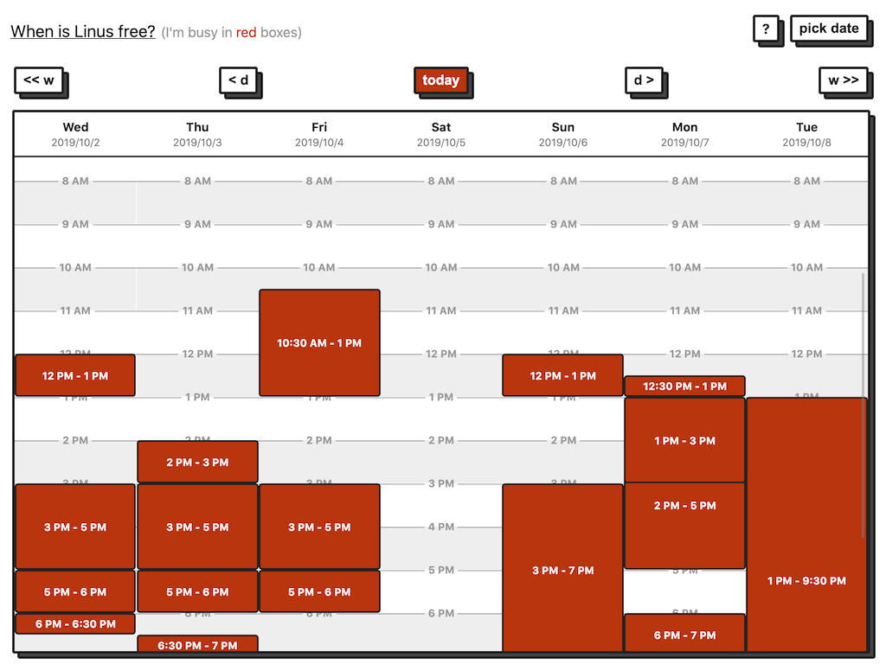

# Frieden ✌️

Frieden is my personal, read-only public availability calendar, to reduce the back-and-forth in scheduling one-on-one meetings. Try the live app at [free.linus.zone](https://free.linus.zone).

Frieden is built with my usual arsenal of homebrew tools:

- A simple Go backend, proxying Google Calendar's API
- [Torus](https://github.com/thesephist/torus) driving the web UI
- [blocks.css](https://github.com/thesephist/blocks.css) for some visual flair



## Usage and deployment

Frieden is deployed as a [systemd service](frieden.service) running as a static binary in Linux. You'll also need your calendars set up correctly with Google Calendar.

### Deployment secrets

To run Frieden, you'll need to place a `secrets.json` file in the root of the project. That file should look like this:

```json
{
    "apiKey": "<your api key>",
    "calendars": [
        "you@gmail.com",
        "another-calendar@gmail.com"
    ]
}
```

You'll first need a Google Calendar API key, which you can find [here on their developer site](https://developers.google.com/calendar). Place that in the secrets file as the `"apiKey"`.

You'll also need to configure each calendar you want Frieden to proxy in the following way:

1. Set "Access Permissions" in calendar settings to be public, and "see only free/busy details" at least (if not full details)
2. Grab the calendar ID (commonly the user email if it's their primary calendar) and place it in `./secrets.json`

With these permissions, Frieden should be able to access the free/busy details of your calendars.
